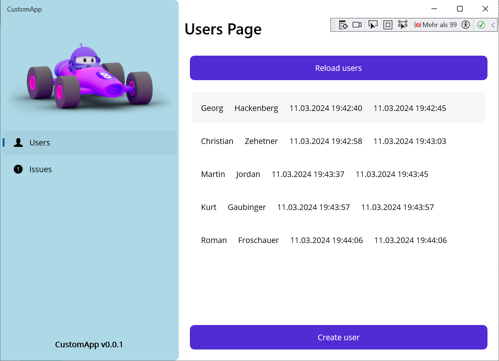
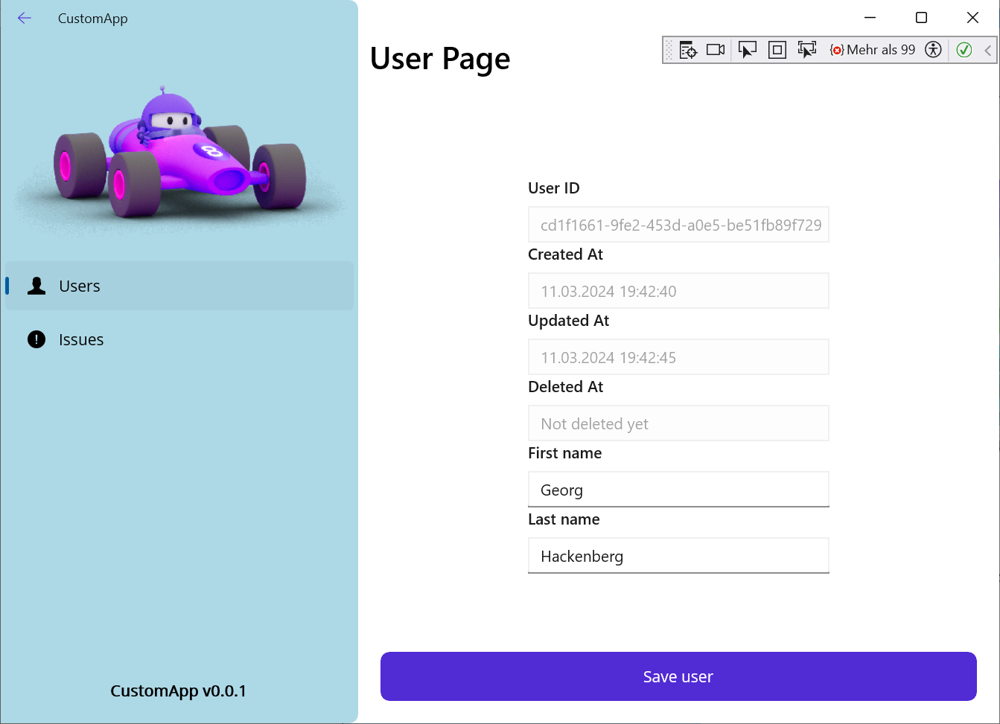
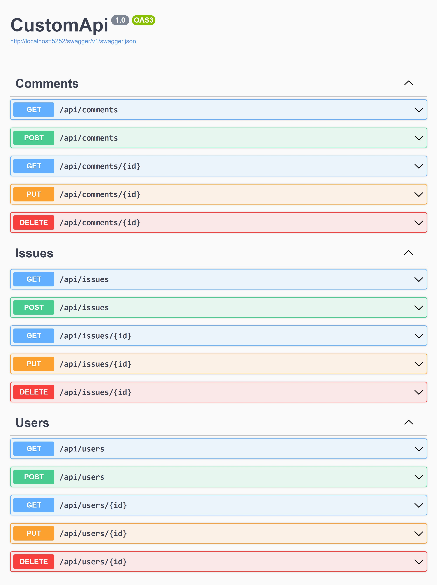
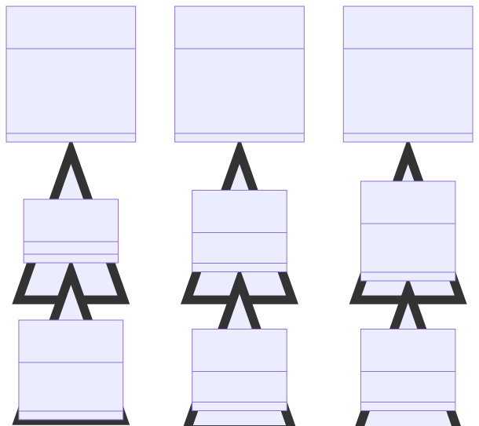

# CSharp .NET MAUI / ASP.NET Sample

This project contains a **Sample Application** based on the awesome **.NET MAUI** and **ASP.NET** frameworks. Note that .NET MAUI allows you to build cross-platfrom graphical user interfaces, while ASP.NET supports you in building Cloud services. Here is a screenshot of the graphical user interface of this sample application:

## Screenshots

In the following, we provide screenshots of the sample application to give a first impression of its functionality. The following screenshots are included:

1. **.NET MAUI Users Page** provides a list of existing users
2. **.NET MAUI User Page** provides details of one user
3. **ASP.NET Swagger UI** provides the REST API documentation

### .NET MAUI Users Page

The **.NET MAUI Users Page** provides a list of existing users, allows you to reload the list of existing users, and provides means for editing existing users or creating new users. The users are retrieved from the backend service.

### .NET MAUI User Page

The **.NET MAUI User Page** provides means for editing the information of existing users or entering the information of new users and sending the information to the Cloud-based backend services for long-term storage.

### ASP.NET Swagger UI

The **ASP.NET Swagger UI** provides a documentation of the Cloud-based backend services, which are exposed via HTTP REST API. For each endpoint, the expected inputs and provided outputs are shown including examples.

## Software architecture

In the following, we explain the software architecture of the sample application. We divided the expanation into the following subsections:

1. **Package structure** describes the C# packages (i.e. DLLs and EXEs) and their relations.
2. **Data structure** describes the database entities, their attributes, and their relations.

### Package structure

The following diagram explains the package structure of the sample application. The package structure consists of three projects: A .NET MAUI application project, an ASP.NET werb service project, and a common class library project. Furthermore, the .NET MAUI application communicates with the ASP.NET web service via HTTP REST protocol.

### Data structure

The following diagram explains the data structrure of the sample application: The data structure consists of three classes: A user class representing the users of the application, an issue class representing the issues created by the users, and a comment class representing comments created by the users and contained in issues.

### Message structure

The following diagram explains the message structure of the sample application used for communication between the graphical user interface and the service via HTTP REST. For each entity (i.e. user, issue, comment), the structure of the HTTP responses as well as the HTTP POST and HTTP PUT requests are described.

### Interface structure

The following diagram explains the interface structure of the sample application. For each entity (i.e. user, issue, comment), methods are provided for listing all existing entity instances, creating a new instance, getting an existing instance, updating an existing instance, and deleting an existing instance.

